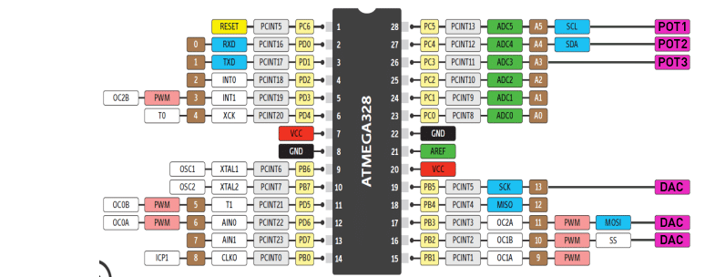

# CFO EUROPROTO 1
# programming the module
 
the CFO EUROPROTO is based on an atmega328 chip, which is the same chip that sits at the centre of a typical arduino. this means we can program the module using the arduino software.

to program the module, first download the arduino IDE from https://www.arduino.cc/

if you have never programmed an arduino before and need help installing the software / getting your head around microcontrollers take a look [here](https://www.arduino.cc/en/Guide/HomePage)

since the CFO EUROPROTO has no USB port, only a serial connection, you will need to use a USB to serial connecter to connect to the board. a nice USB to serial cable [is this one](https://eu.mouser.com/ProductDetail/FTDI/TTL-234X-5V?qs=sGAEpiMZZMve4%2FbfQkoj%252BHKRsWEfBN5HUqn9pYz616g%3D)

INSERT IMAGE

cheaper dongle style versions are [available on amazon](https://www.amazon.de/Adapter-FT232RL-Arduino-Christians-Technikshop/dp/B0178HVEH0/ref=pd_sbs_147_3/257-0929842-9837212?_encoding=UTF8&pd_rd_i=B0178HVEH0&pd_rd_r=15a07e5a-6d58-11e9-bd12-7dbd624bdfef&pd_rd_w=kramz&pd_rd_wg=jAAss&pf_rd_p=74d946ea-18de-4443-bed6-d8837f922070&pf_rd_r=FF938E6AVQXE9MZTNBNK&psc=1&refRID=FF938E6AVQXE9MZTNBNK)

INSERT IMAGE

example code is in the [arduino folder](../arduino) in this repository. start with the testcode and open the serial port to see if your potentiometers are connected correctly. once this works, move on the the sound examples :)

if you would like to understand more about sound, sound synthesis, and how sound works in a computer / digital environment, i recommend reading [this processing tutorial](https://processing.org/tutorials/sound/)