# CFO EUROPROTO 1
# build instructions
for digital modular workshop at MPlab sound days
http://sound.mplab.lv/workshops/jacob-remin/
jacob remin, liepaja, may 2019

# soldering

say hello to your PCB
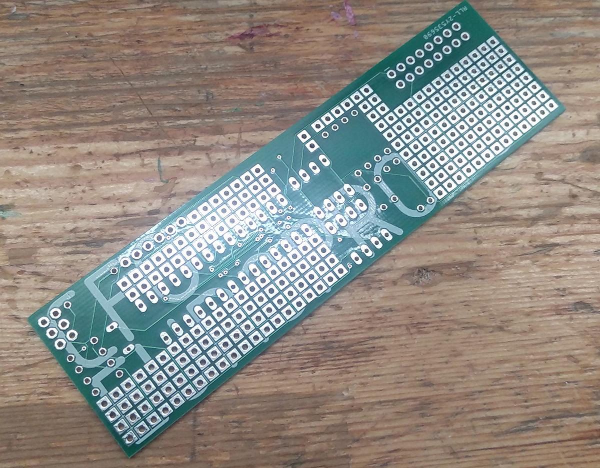

first solder the resistors. they are all 10k ohm. they have no polarity, but try to align them all the same way. just pick one. it makes it easier to see what is going on for other people (or yourself in a couple of weeeks)
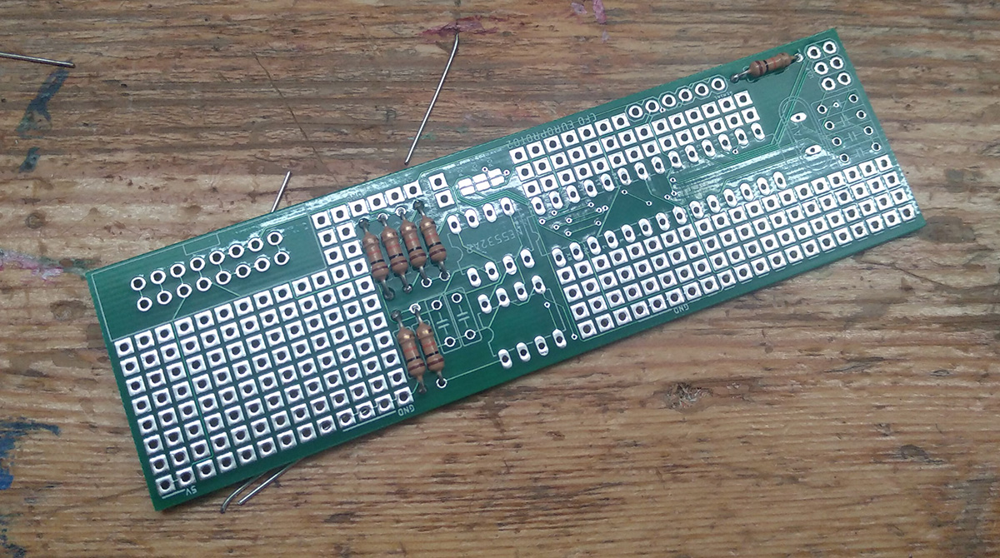

solder the 16mhz chrystal. the crystal has no polarity
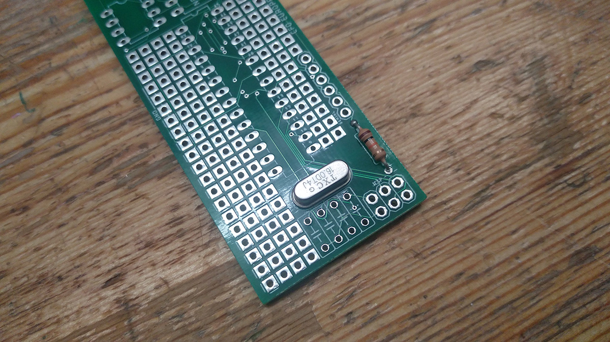

solder the 18pf capacitors. they have no polarity
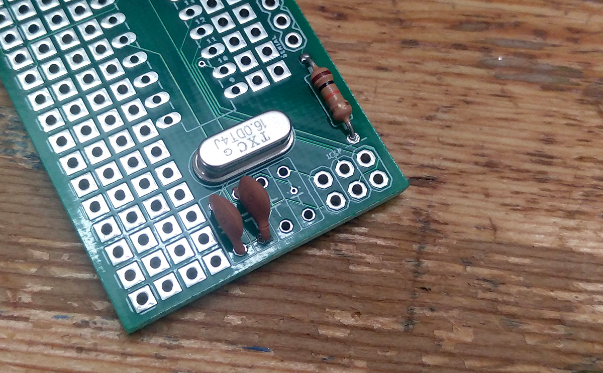

solder the 100uf capacitors. again no polarity here
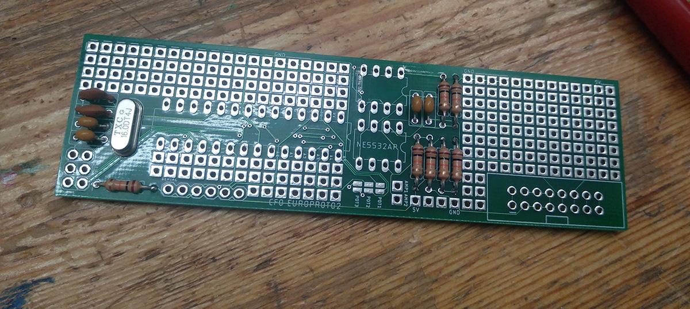

solder the IC sockets. NB: make sure to orient them correctly
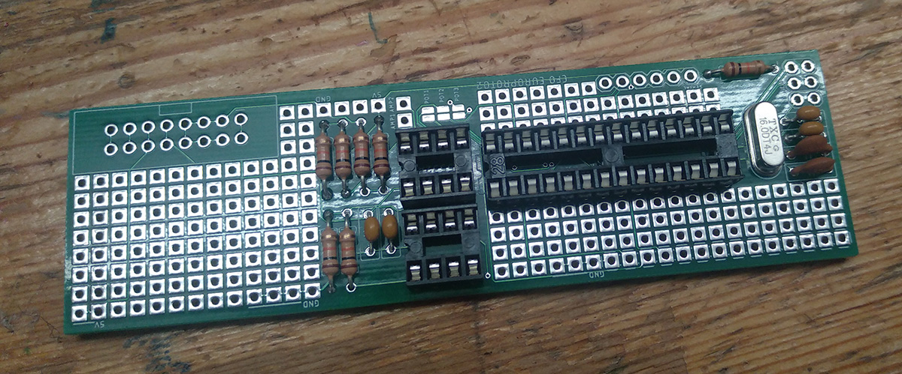

solder the programmer pin headers
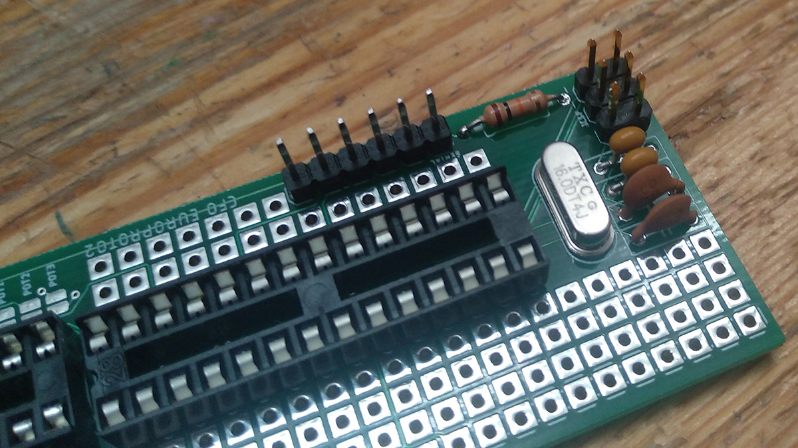

solder the power connector. for this workshop we will use 2 rows of ordinary male pin headers. to make sure they fit your eurorack power cable, connect the pin headers to the power cable while soldering them. this way they are correctly aligned
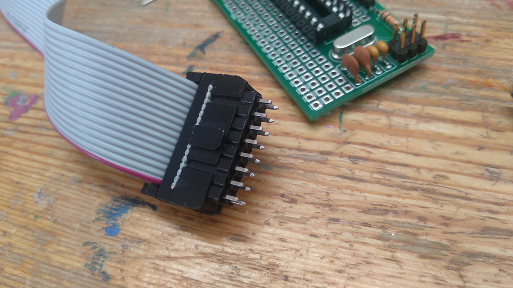
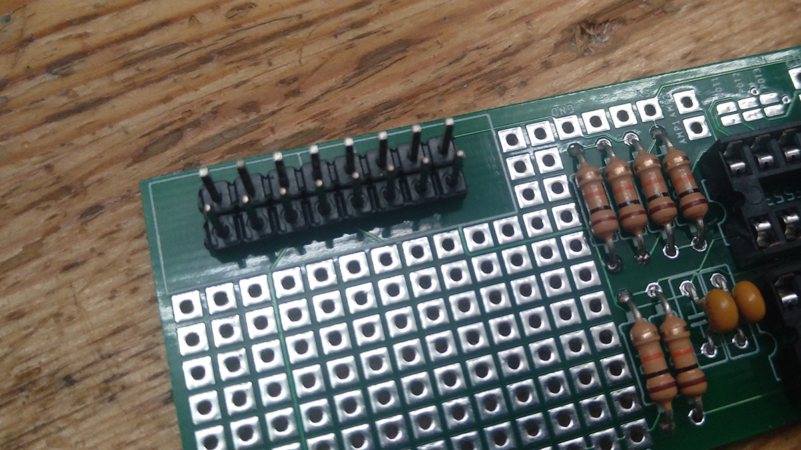

to route the potentiometers 3 pins to the atmega328, apply solder to the 3 solder bridges marked POT1, POT2, and POT3
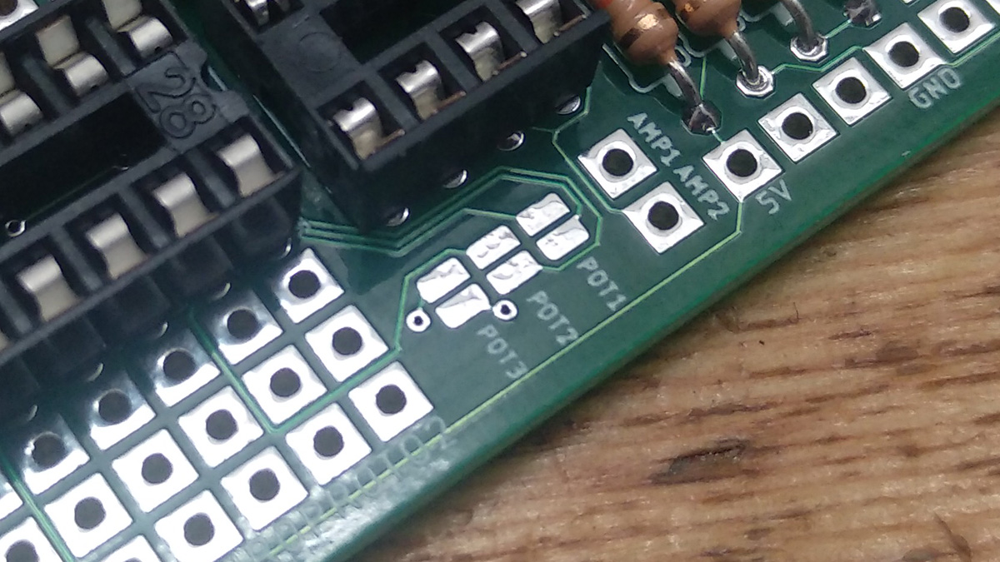
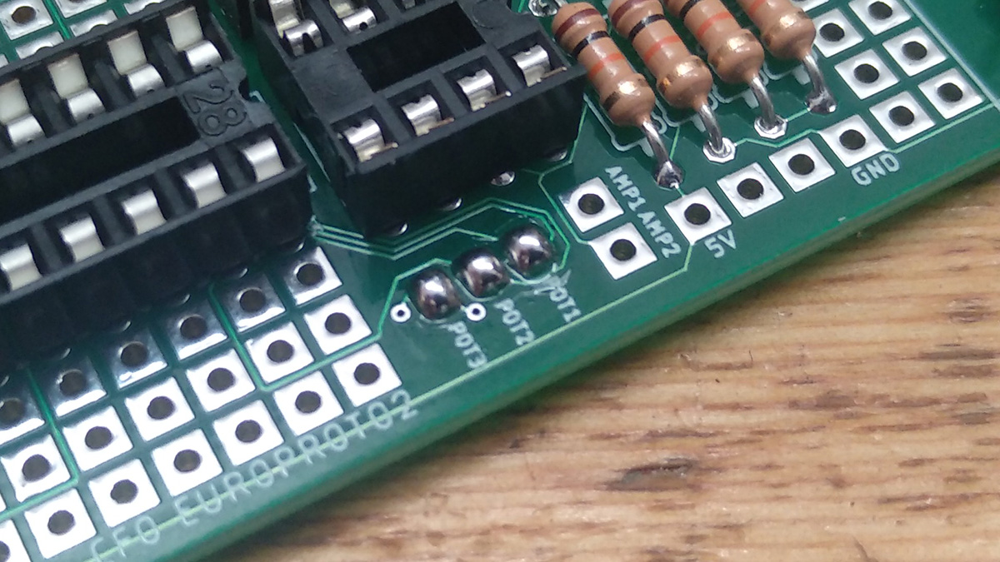

solder the angled pin headers to the back of the PCB. NB: careful with the orientation: if you solder the pin headers to the top of the PCB your module will not fit in your synthesizer!

mount the ICs in the IC sockets. NB: mind the orientation of the chips, and be careful not to mix up the DAC and the opamp

mount the ICs in the IC sockets. NB: mind the orientation of the chips, and be careful not to mix up the DAC and the opamp

