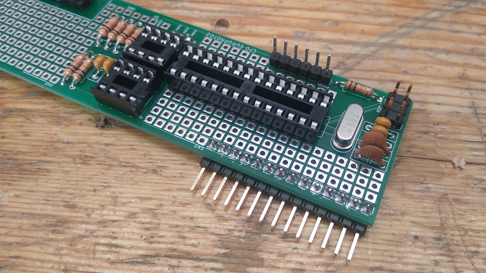

# CFO EUROPROTO 1
# build instructions
jacob remin, may 2019

# soldering

say hello to your PCB

first solder the resistors. they are all 10k ohm

solder the 16mhz chrystal. the crystal has no polarity

solder the 18pf capacitors

solder the 100uf capacitors

solder the IC sockets. make sure to orient them correctly

solder the programmer pin headers

solder the power connectore. for this workshop we will use 2 rows of ordinary male pin headers. to make sure they fit your eurorack power cable, connect the pin headers to the power cable while soldering them. this way they are correctly aligned

to route the potentiometers 3 pins to the atmega328, apply solder to the 3 solder bridges marked POT1, POT2, and POT3

solder the angled pin headers to the back of the PCB. NB: careful with the orientation: if you solder the pin headers to the top of the PCB your module will not fit in your synthesizer!

mount the ICs in the IC sockets. NB: mind the orientation of the chips, and be careful not to mix up the DAC and the opamp

mount the ICs in the IC sockets. NB: mind the orientation of the chips, and be careful not to mix up the DAC and the opamp

